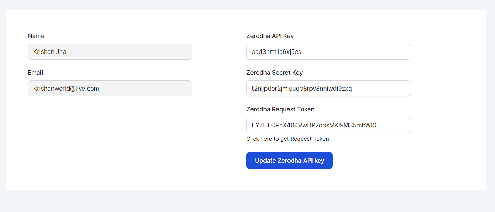
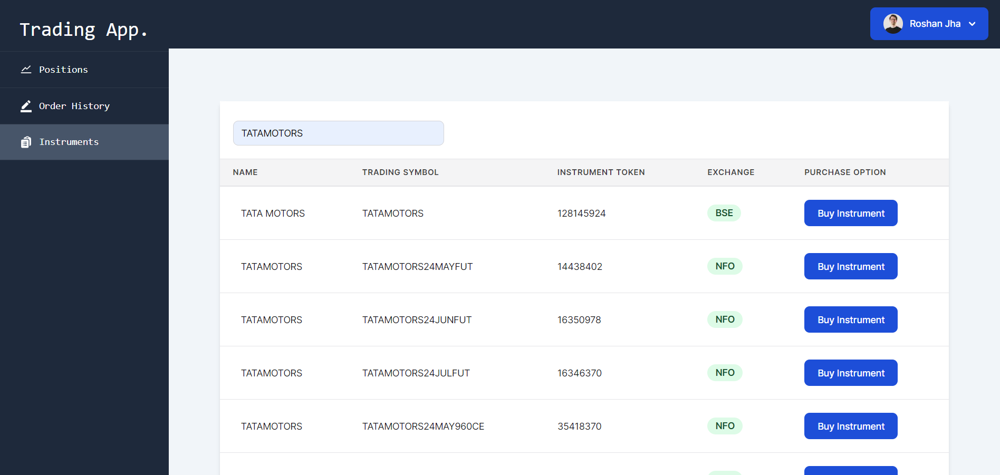
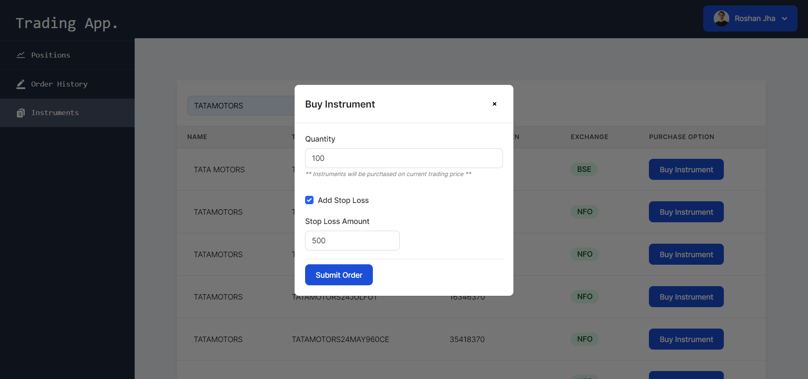
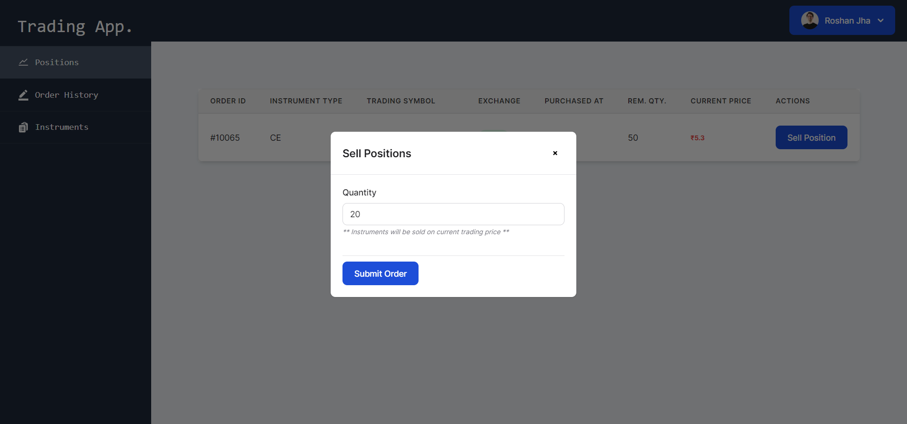
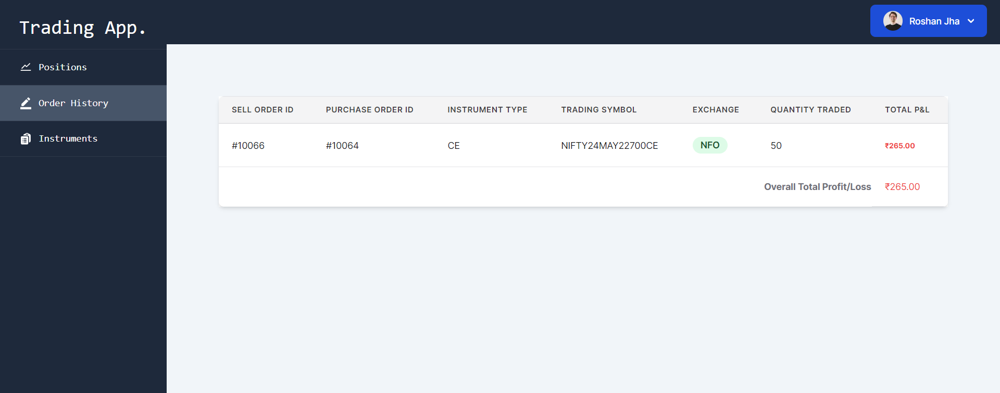

This is a Paper Trading Application built on Next JS framework using Zerodha Kite's API.

It uses MySQL as database and also contain Laravel Inside to run database migration features for SQL

## Installation of Paper Trading Next JS App on Local Machine

First Clone this repository on your local machine from Github and run npm install to run all the node dependencies

Second Create env.local file in the root directory of this project, and fill it in as below

        DB_CONNECTION=mysql
        DB_HOST=<your-mysql-host>
        DB_PORT=<your-mysql-port>
        DB_DATABASE=<your-mysql-database>
        DB_PASSWORD=<<PASSWORD>>

        GITHUB_ID=<your-github-id>
        GITHUB_SECRET=<your-github-secret>

        NEXTAUTH_URL=<your-nextauth-url>
        NEXTAUTH_SECRET=<your-nextauth-secret>

Second, run the development server:

```bash
npm run dev
# or
yarn dev
# or
pnpm dev
# or
bun dev
```

Open [http://localhost:3000](http://localhost:3000) with your browser to see the result.

## Installation of Backend Server on Local Machine

This Project Code contains a second application inside the folder /server which has express installed to manage request and response
this server project serves below purposes

* Creates Web Socket with the Zerodha to show Live Pricing of Paper Instrument.
* Update Instrument Daily from Zerodha API.
* Helps Placing Paper Order on Latest Curent Value fetched from Zerodha.

You can Install this project by simply running the cmd `npm install` and then run `nodemon index.js` to run the server.


## MySQL Setup

This project uses MySQL Database to store User Data, Paper Orders and Instrument List

In order to Setup the MySql Database we have created a small Laravel Project inside it by the name of 'Laravel-support'

Which is currently running on Laravel 8 Guide to Install Laravel 8 can be found on below link 
'https://laravel.com/docs/8.x#installation-via-composer'


Once Installed run the Laravel migration files to setup MySQL Database. 


## Zerodha API Key and Secret Key

Once setting up all the process above. Create a New User Account on the Application. 

Then Register yourself on https://developers.kite.trade/login 
and create a new application. Put Your Zerodha Key and API Secret Key and Token in /profile-settings page




## Download Instrument Data

Once Zerodha setting are updated move to server application to Download Instrument Data and Save In your Database run update_csv() method which will automatically download and save instrument data on your database.


## Instrument Data and Buy Order



On /instruments page you can check all the instrument that are there in your Downloaded Instrument List.

In order to purchase an instrument click on Buy Instrument



and after Entering value submit your order.


## Sell Order
After Placing your order you can check your Trading Position
on /live-trade page there you can check the current trading value of your instruments and see if they are making loss or profit.

In Order to sell the Instrument click on Sell Position and fill the below values.



# Order History & Total P&L Balance
You can check your Order History on /order-history page and there you can check the all the historical order and see what is the exact amount you have earned through this paper trading.

